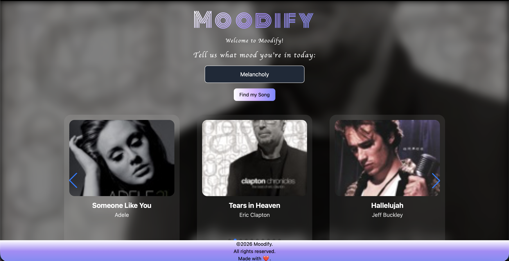

# Moodify 🎵

Say goodbye to algorithm fatigue. Moodify recommends music based on your actual human mood in the moment (not your historical search data). Tell the app exactly how you are feeling, and watch it curate your perfect vibe.

(And yes, as the codebase comments suggest, this frontend is lovingly held together by hope, duct tape, and CSS).

## 🔗 Live Links

Live Web App: [here](https://moodify2026.netlify.app)

Production API: [here](https://moodify-ia9v.onrender.com)

## 🚀 How It Works & Architecture

Moodify coordinates semantic AI analysis, real-time metadata lookups, and rich media state-handling in a seamless loop:

```
[ User Input ]  --> "Feeling cozy on a rainy evening"
       |
       v
[ FastAPI Backend ] 
       |
       +--> (1) Groq API (LLaMA 3.3-70B) 
       |        Processes context & outputs structured JSON array of 10 tracks
       |
       +--> (2) iTunes Search API (Asynchronous Concurrency)
                Fetches track metadata, artwork, and 30s previews in parallel via asyncio.gather
       |
       v
[ Vanilla JS Frontend ]
       |
       +--> Instantiates a dynamic Swiper.js carousel (3-card viewport)
       +--> Manages active HTML5 audio streams with clean interruption safety
       +--> Dynamically morphs background art based on active slides
```

## 🛠️ Engineering & Performance Highlights

This project was built to solve practical engineering challenges, focusing on speed, clean data parsing, and smart browser memory management.

### ⚡ Asynchronous Concurrency (Backend Optimization)

Instead of blocking the system with 10 sequential, blocking HTTP requests to the iTunes API, the backend leverages asyncio.gather and httpx.AsyncClient to run all 10 API calls in parallel. This dramatically cuts backend latency, ensuring an instantaneous user experience.

```python
# A look inside main.py
await asyncio.gather(*[fetch_itunes_data(client, song) for song in songs])
```

### 🧹 Defensive String Parsing

Large Language Model outputs can occasionally contain unexpected artifacts or conversational noise. The backend applies clean string-cleansing logic (such as stripping out " ft." or " feat." from artist structures) to normalize inputs and maximize search accuracy against the iTunes database.

```python
# Cleaning artist names for accurate iTunes lookups
clean_artist = song['artist'].split(" ft.")[0].split(" feat.")[0]
```

### 🧠 Active Memory & Instance Lifecycles (Frontend)

To prevent overlapping audio streams, the UI tracks and dynamically pauses previous Audio elements before starting new tracks. Additionally, the application explicitly runs swiperInstance.destroy() prior to rendering a new search, completely avoiding DOM memory leaks.

```javascript
// Keeping the DOM clean and memory-safe inside index.html
if (swiperInstance) {
    swiperInstance.destroy(); 
    swiperInstance = null; 
}
```

## 💻 Tech Stack

Backend: FastAPI (Python), Uvicorn, HTTPX

AI Integration: Groq Cloud API, LLaMA 3.3 70B Versatile

Third-Party Media API: iTunes Search API

Frontend UI: Vanilla ES6+ JavaScript, Tailwind CSS (Utility Framework), SwiperJS (Touch Slider Library), Google Fonts (Monoton, Molle)

Hosting/Deployment: Render (Backend API), Netlify (Frontend client)

## ⚙️ How to Run Locally

Prerequisites

Python 3.9+

A Groq API Key (Get one free at console.groq.com)

### 1. Clone & Set Up the Backend

```bash
# Clone the repository
git clone <your-repo-url>
cd moodify

# Install dependencies
pip install -r requirements.txt
```

### 2. Configure Environment Variables

Create a file named .env in your root directory and insert your API key:

```bash
GROQ_API_KEY=your_actual_groq_api_key_here
```

### 3. Start the Backend Server

```bash
uvicorn main:app --reload
```

The API will spin up and run on http://127.0.0.1:8000.

### 4. Serve the Frontend

In a separate terminal window, launch a local web server from your project root:

```bash
python3 -m http.server 3000
```

Open http://localhost:3000 in your web browser to experience Moodify.

### 🔮 Roadmap (v2 & Beyond)

[ ] Tinder-Style Swipe Interface: Transition from the carousel layout to a stacked, swipe-to-like layout.

[ ] Persistent User History: Save user search terms and match patterns locally to build a mood-history timeline.

[ ] Spotify Playlist Sync: Integrate with Spotify's Web API to let users instantly export their generated recommendations into active playlists.

[ ] Multi-Language Support: Allow LLaMA to interpret moods in Spanish, Hindi, French, and other languages.

## A snapshot from MOODIFY

 
Made with ❤️ · © 2026 Moodify